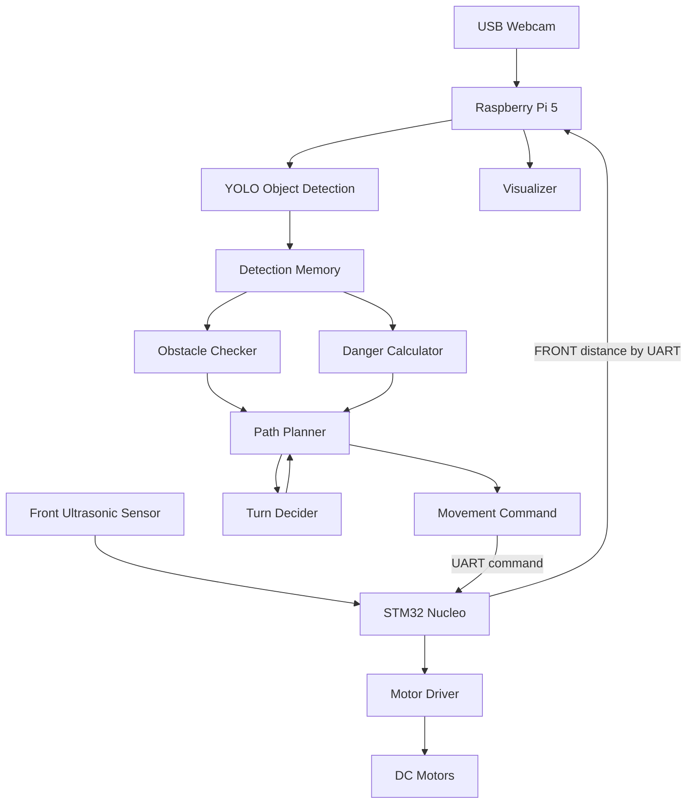

# Guide Dog Obstacle Avoidance Robot

Raspberry Pi 5와 STM32 Nucleo 보드를 이용한 시각장애인을 위한 장애물 인식 및 회피 로봇 프로젝트입니다.

카메라 영상 기반 YOLO 객체 탐지와 STM32에서 전달받은 초음파 센서 거리값을 함께 사용하여, 로봇이 전방 장애물을 감지하고 `STOP` 후 `TURN_LEFT` 또는 `TURN_RIGHT` 명령으로 회피하도록 구성했습니다.

---

## 1. Project Overview

이 시스템은 카메라로 입력되는 실시간 영상 프레임을 YOLO 모델에 전달하여 주변 객체를 인식합니다.

YOLO는 프레임 내의 객체를 인식하고, 각 객체의 위치를 바운딩 박스 형태로 출력합니다.

Raspberry Pi는 객체 인식의 박스 크기,위치와 STM32 Nucleo 보드에서 전달받은 초음파 센서 거리 데이터를 함께 사용하여 장애물 위험도를 계산합니다.

위험도 계산 결과를 통해 장애물이 없는 방향으로 회전해 시각장애인을 인도해줍니다.


---

## 2. System Architecture

| Device | Role |
|---|---|
| Raspberry Pi 5 | 카메라 프레임 처리, YOLO 객체 탐지, 위험도 계산, 회피 방향 결정, STM32 명령 전송 |
| STM32 Nucleo | 초음파 센서값 측정, 라즈베리파이로 거리값 전송, 명령 수신, 모터 제어 |
| USB Webcam | 전방 영상 입력 |
| Ultrasonic Sensor | 전방 장애물 거리 측정 |
| Motor Driver / DC Motors | STM32 PWM 신호 기반 로봇 구동 |

---

## 3. Overall System Flow



---

## 4. Main Data Flow

| Step | Data Flow | Description |
|---|---|---|
| 1 | USB Webcam → Raspberry Pi | 카메라 프레임 입력 |
| 2 | Raspberry Pi → YOLO | 객체 탐지 수행 |
| 3 | YOLO → Detection Memory | YOLO가 잠깐 놓친 객체를 짧은 시간 유지 |
| 4 | Detection Memory → Obstacle Checker | 큰 객체 또는 가까운 초음파 거리 여부 판단 |
| 5 | Detection Memory + Ultrasonic → Danger Calculator | LEFT / CENTER / RIGHT 위험도 계산 |
| 6 | Path Planner → Turn Decider | 회피 방향 선택 |
| 7 | Path Planner → STM32 | `FREE`, `STOP`, `TURN_LEFT`, `TURN_RIGHT` 명령 전송 |
| 8 | STM32 → Motor Driver | 모터 제어 신호 출력 |
| 9 | Visualizer | 박스, 거리, 명령, 위험도, FPS 출력 |

---

## 5. Software Structure

| File | Description |
|---|---|
| `main_threaded_stm32_withpathplanner.py` | 전체 실행 루프. 카메라, YOLO, STM32 통신, 경로 판단, 화면 출력을 연결 |
| `camera.py` | USB 카메라 초기화 및 해제 |
| `detector.py` | YOLO 모델 로드 및 객체 탐지 |
| `detection_memory.py` | 객체가 한두 프레임 사라져도 짧은 시간 동안 이전 탐지 결과 유지 |
| `box_utils.py` | 바운딩 박스 면적 계산, 클래스별 최소 박스 면적 확인, 화면 구역 판단 |
| `obstacle_checker.py` | 큰 객체 감지 여부와 초음파 거리 위험 여부 판단 |
| `danger_calculator.py` | YOLO 박스 크기와 FRONT 초음파 거리값으로 LEFT / CENTER / RIGHT 위험도 계산 |
| `turn_decider.py` | 위험도와 가장 큰 객체 위치를 기준으로 좌회전/우회전 결정 |
| `path_planner.py` | FREE / STOPPING / AVOIDING 상태 기반 최종 명령 결정 |
| `stm32_comm.py` | STM32와 UART 시리얼 통신. 센서값 수신, 명령 송신 |
| `find_port.py` | `/dev/ttyACM*`, `/dev/ttyUSB*` 포트 자동 탐색 |
| `visualizer.py` | 카메라 화면에 탐지 박스, 거리, 명령, 위험도, FPS 표시 |
| `fps_counter.py` | FPS 계산 |
| `config.py` | 모델 경로, 카메라 크기, 임계값, 명령 문자 매핑 등 설정 관리 |

> 현재 코드에서는 `command_stabilizer.py`를 사용하지 않습니다. 명령 변화는 `PathPlanner`의 상태 머신과 `COMMAND_INTERVAL_SEC` 기반 중복 전송 방지로 관리합니다.

---

## 6. Core Behavior

### 6.1 State Machine

`path_planner.py`는 세 가지 상태를 사용합니다.

| State | Meaning |
|---|---|
| `FREE` | 위험이 없어 전진 가능한 상태 |
| `STOPPING` | 위험 감지 후 일정 시간 `STOP`을 유지하는 상태 |
| `AVOIDING` | 정지 시간이 끝난 뒤 `TURN_LEFT` 또는 `TURN_RIGHT`로 회피하는 상태 |

동작 흐름은 다음과 같습니다.

flowchart TD
    A[프레임 입력] --> B[YOLO 감지 결과로 위험도 계산]
    B --> C[초음파 거리값으로 위험도 추가]

    C --> D{장애물 감지됨?}

    D -- 아니오 --> E[pending_turn 초기화]
    E --> F[FREE 반환]

    D -- 예 --> G{"이미 예약된 회전 명령<br/>(pending_turn)이 있음?"}

    G -- 예 --> H[예약된 TURN_LEFT <br/>또는 TURN_RIGHT 실행]
    H --> I[pending_turn 초기화]
    I --> J[TURN_LEFT <br/>또는 TURN_RIGHT 반환]

    G -- 아니오 --> K[회전 방향 결정]
    K --> L[pending_turn에 <br/>회전 명령 저장]
    L --> M[먼저 STOP 반환]

    M --> N[다음 프레임에서<br/> 회전 명령 실행]

---

### 6.2 Obstacle Trigger

장애물 위험은 `obstacle_checker.py`에서 판단합니다.

위험 조건은 다음 중 하나입니다.

| Condition | Meaning |
|---|---|
| YOLO 객체 박스 면적이 클래스별 최소 면적 이상 | 화면에 충분히 큰 장애물이 있음 |
| FRONT 초음파 거리값이 `AVOID_DISTANCE_CM`보다 작음 | 전방 장애물이 너무 가까움 |

둘 중 하나라도 참이면 `danger_triggered()`가 `True`를 반환하고, `PathPlanner`는 `STOPPING` 상태로 들어갑니다.

---

### 6.3 Danger Calculation

`danger_calculator.py`는 위험도를 다음 세 영역으로 나누어 계산합니다.

```text
LEFT | CENTER | RIGHT
```

객체 중심 x좌표를 기준으로 영역을 나누고, 바운딩 박스 면적을 `BOX_AREA_SCALE`로 나누어 위험도 점수로 사용합니다.

```python
danger_score = box_area / BOX_AREA_SCALE
```

너무 작은 객체는 장애물로 보지 않기 위해 클래스별 최소 박스 면적보다 작은 객체는 제외합니다.

```python
if box_area < min_box_area:
    continue
```

FRONT 초음파 센서가 `AVOID_DISTANCE_CM`보다 가까운 값을 보내면 중앙 위험도에 큰 값을 추가합니다.

```python
danger["CENTER"] += 10.0
```

현재 위험도 구조는 다음과 같습니다.

```python
danger = {
    "LEFT": 0.0,
    "CENTER": 0.0,
    "RIGHT": 0.0,
}
```

---

### 6.4 Turn Decision

`turn_decider.py`는 다음 순서로 회피 방향을 결정합니다.

| Priority | Rule | Command |
|---|---|---|
| 1 | 왼쪽 위험도가 오른쪽보다 큼 | `TURN_RIGHT` |
| 2 | 오른쪽 위험도가 왼쪽보다 큼 | `TURN_LEFT` |
| 3 | 좌우 위험도가 같음 + 가장 큰 객체가 화면 중앙보다 왼쪽 | `TURN_RIGHT` |
| 4 | 좌우 위험도가 같음 + 가장 큰 객체가 화면 중앙보다 오른쪽 | `TURN_LEFT` |
| 5 | 판단할 정보가 없음 | `TURN_RIGHT` |

즉, 기본 원칙은 **위험한 쪽의 반대 방향으로 회피**하는 것입니다.

---

## 7. Current Command Logic

현재 최종 명령은 다음 네 가지를 중심으로 사용합니다.

| Planner Command | Meaning |
|---|---|
| `FREE` | 위험 없음 / 전진 가능 상태 |
| `STOP` | 위험 감지 후 정지 |
| `TURN_LEFT` | 왼쪽으로 회피 |
| `TURN_RIGHT` | 오른쪽으로 회피 |

`main_threaded_stm32_withpathplanner.py`에서는 `COMMAND_TO_CHAR` 설정을 통해 명령 문자열을 STM32에 보낼 문자로 변환합니다.

예시:

```python
stm32_command = COMMAND_TO_CHAR.get(command, "S")
```

명령이 설정에 없으면 안전을 위해 기본값으로 `S`, 즉 STOP 문자를 보냅니다.

또한 같은 명령을 너무 자주 반복해서 보내지 않도록, 명령이 바뀌고 `COMMAND_INTERVAL_SEC` 시간이 지난 경우에만 STM32로 전송합니다.

---

## 8. STM32 Communication

`stm32_comm.py`는 별도 스레드에서 STM32와 계속 통신합니다.

주요 역할은 다음과 같습니다.

1. STM32 시리얼 포트 연결
2. STM32에서 들어오는 문자열 읽기
3. 수신한 원본 문자열을 터미널에 출력
4. 문자열에서 숫자를 찾아 FRONT 거리값으로 파싱
5. 가장 최근 거리값 저장
6. Raspberry Pi에서 결정한 명령을 큐에 넣고 STM32로 전송
7. 종료 시 스레드와 시리얼 포트 정리

STM32가 보내는 거리 문자열 예시는 다음과 같습니다.

```text
35.2
FRONT:35.2
F=35.2
```

코드는 문자열 안에서 첫 번째 숫자를 찾아 다음 형태로 저장합니다.

```python
{
    "FRONT": 35.2
}
```

---

## 9. Port Auto Detection

`find_port.py`는 STM32 포트를 자동으로 찾습니다.

확인하는 포트는 다음과 같습니다.

```text
/dev/ttyACM*
/dev/ttyUSB*
```

둘 다 연결되어 있으면 정렬 후 첫 번째 포트를 사용합니다.

```text
Found STM32 ports: ['/dev/ttyACM0', '/dev/ttyUSB0']
Using STM32 port: /dev/ttyACM0
```

---

## 10. Visualization

`visualizer.py`는 OpenCV 화면에 다음 정보를 출력합니다.

| Display | Meaning |
|---|---|
| Bounding Box | YOLO가 탐지한 객체 위치 |
| Class Name / Confidence | 객체 이름과 신뢰도 |
| Center Point | 객체 중심점 |
| `F: xx.x cm` | FRONT 초음파 거리값 |
| `CMD: ...` | 현재 PathPlanner 명령 |
| `L / C / R` | 좌측, 중앙, 우측 위험도 |
| FPS | 초당 처리 프레임 수 |

화면 없이 실행하려면 `main_threaded_stm32_withpathplanner.py`에서 다음 부분을 주석 처리하면 됩니다.

```python
setup_window()
show_frame(frame)
key = cv2.waitKey(1)
```

카메라 화면을 띄우지 않아도 `cap.read()`가 계속 실행되므로 프레임 입력과 YOLO 탐지는 계속 가능합니다.

---

## 11. Test Mode Without STM32

STM32 없이 테스트하려면 `config.py`에서 다음과 같이 설정합니다.

```python
USE_STM32 = False
```

이 경우 실제 STM32 거리값 대신 `FAKE_DISTANCES_CM` 값을 사용합니다.

```python
FAKE_DISTANCES_CM = {
    "FRONT": 100.0
}
```

실행하면 터미널에 다음과 같이 표시됩니다.

```text
STM32 disabled. Running with fake distances.
[TEST MODE] Command: FREE -> F distance: {'FRONT': 100.0} danger: {...}
```

---

## 12. How to Run

### 12.1 Install dependencies

```bash
pip install ultralytics opencv-python pyserial
```

Raspberry Pi 환경에서는 OpenCV 설치가 느리거나 실패할 수 있으므로, 필요하면 시스템 패키지를 사용할 수 있습니다.

```bash
sudo apt update
sudo apt install python3-opencv
```

---

### 12.2 Run main program

```bash
python main_threaded_stm32_withpathplanner.py
```

가상환경을 사용하는 경우 예시는 다음과 같습니다.

```bash
/home/willtek/work/env/bin/python /home/willtek/work/guidedogpath/raspi5/main_threaded_stm32_withpathplanner.py
```

---

## 13. Important Config Values

`config.py`에서 주로 조정하는 값은 다음과 같습니다.

| Config | Meaning |
|---|---|
| `MODEL_PATH` | 사용할 YOLO 모델 경로 |
| `CAMERA_INDEX` | 사용할 카메라 번호 |
| `FRAME_WIDTH`, `FRAME_HEIGHT` | 카메라 프레임 크기 |
| `BUFFER_SIZE` | 카메라 버퍼 크기 |
| `IMG_SIZE` | YOLO 입력 이미지 크기 |
| `CONFIDENCE_THRESHOLD` | YOLO 객체 탐지 신뢰도 기준 |
| `MIN_BOX_AREA_BY_CLASS` | 클래스별 장애물로 인정할 최소 박스 면적 |
| `DEFAULT_MIN_BOX_AREA` | 클래스별 값이 없을 때 사용할 기본 최소 박스 면적 |
| `BOX_AREA_SCALE` | 박스 면적을 위험도 점수로 바꿀 때 사용하는 나눗값 |
| `AVOID_DISTANCE_CM` | FRONT 초음파 센서가 이 값보다 가까우면 위험으로 판단 |
| `STOP_HOLD_TIME_SEC` | 위험 감지 후 STOP을 유지할 시간 |
| `COMMAND_INTERVAL_SEC` | STM32로 명령을 다시 보낼 최소 간격 |
| `DETECTION_MEMORY_HOLD_TIME_SEC` | YOLO가 놓친 객체를 유지하는 시간 |
| `USE_STM32` | 실제 STM32 사용 여부 |
| `FAKE_DISTANCES_CM` | STM32 없이 테스트할 때 사용할 가짜 거리값 |
| `COMMAND_TO_CHAR` | PathPlanner 명령을 STM32 문자 명령으로 변환 |

---

## 14. Notes

- 객체 두 개가 화면에서 겹쳐 보여도 YOLO는 보통 각각의 바운딩 박스를 따로 출력하려고 합니다. 다만 심하게 겹치면 한 객체만 남거나, 박스가 흔들릴 수 있습니다.
- 박스가 순간적으로 화면 전체를 덮을 정도로 커지는 경우, YOLO 오탐지 또는 바운딩 박스 흔들림일 수 있습니다. 이때 클래스별 `MIN_BOX_AREA_BY_CLASS`, `CONFIDENCE_THRESHOLD`, `DETECTION_MEMORY_HOLD_TIME_SEC` 값을 조정해야 합니다.
- 현재 초음파 입력은 `FRONT` 하나를 기준으로 작성되어 있습니다. 좌/우 센서를 추가하려면 `stm32_comm.py`, `danger_calculator.py`, `obstacle_checker.py`, `turn_decider.py`에서 거리 dictionary 구조를 확장해야 합니다.
- 현재 `PathPlanner`는 위험 감지 시 항상 `STOP`을 먼저 출력하고, `STOP_HOLD_TIME_SEC` 이후 회피 방향을 결정합니다.

---

## 15. Current Module Summary

```text
camera.py
  ↓
detector.py
  ↓
detection_memory.py
  ↓
obstacle_checker.py ─┐
danger_calculator.py ├─ path_planner.py ─ turn_decider.py
stm32_comm.py ───────┘
  ↓
STM32 command output
```

